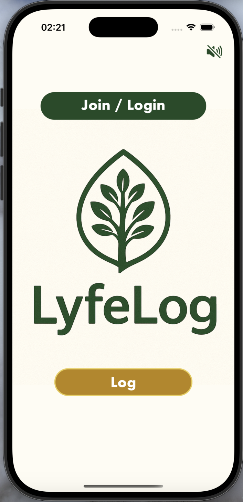

# LyfeLog Journal

LyfeLog is a mobile wellness and journaling application designed to provide a serene and reflective space for users. It features daily mood tracking, guided reflection prompts, and a calming audio experience to promote mental well-being.

The backend is powered by [Appwrite](https://appwrite.io/), a secure, open-source Backend-as-a-Service platform that handles user authentication and data storage.

 <!-- It's recommended to replace this with an actual screenshot of your app -->

## ✨ Features

- **User Authentication**: Secure sign-up and login functionality.
- **Daily Journaling**: A dedicated space to write daily reflections.
- **Mood Tracking**: An intuitive emoji-based system to rate your daily mood.
- **Reflection Prompts**: Instead of relying on a live AI service, the app fetches daily reflection prompts from a pre-populated collection in the Appwrite database, providing variety and inspiration for your journal entries.
- **Log History**: A chronological list of all past journal entries, allowing users to review their journey.
- **Immersive Audio**: Plays calming background music as soon as the app opens, with a convenient mute/unmute button on the home screen.

## 🛠️ Tech Stack

- **Framework**: React Native with Expo
- **Navigation**: Expo Router
- **Backend**: Appwrite (Authentication & Database)
- **Audio**: Expo AV

## 🚀 Getting Started

Follow these instructions to get a copy of the project up and running on your local machine for development and testing purposes.

### Prerequisites

- Node.js (LTS version recommended)
- npm or yarn
- Expo Go app on your mobile device or an Android/iOS simulator.
- An Appwrite instance. You can use Appwrite Cloud or self-host.

### 1. Clone the Repository

```bash
git clone https://github.com/kionamarie/lyfelog.git
cd aum-wellness-app
```

### 2. Install Dependencies

Install the project dependencies using npm or yarn.

```bash
npm install
```

### 3. Set Up Appwrite

1.  **Create a Project**: Log in to your Appwrite console and create a new project.
2.  **Create a Database**:
    - Go to the **Databases** section and create a new database.
    - Copy the **Database ID**.
3.  **Create Collections & Attributes**: Inside your new database, create the following two collections:

    - **`entries` Collection**:

      - **Collection ID**: `entries`
      - **Attributes**:
        - `today` (string, required)
        - `reflectionPrompt` (string, required)
        - `reflection` (string, required)
        - `mood` (integer, required)
        - `userId` (string, required)
      - **Permissions**: Grant `Read`, `Update`, and `Delete` access to `role:member`.

    - **`reflectionprompts` Collection**:
      - **Collection ID**: `reflectionprompts`
      - **Attributes**:
        - `question` (string, required)
      - **Permissions**: Grant `Read` access to `role:any`.

4.  **Populate Prompts**: In the `reflectionprompts` collection, manually add a few strings. Each string should be a `question` attribute containing a reflection prompt (e.g., "What made you smile today?").

### 4. Configure Environment Variables

The project connects to Appwrite using credentials found in `lib/appwrite.js`. For better security and flexibility, you should move these to environment variables.

1.  Create a new file named `.env` in the root of the project.
2.  Add your Appwrite credentials to this file:

    ```
    EXPO_PUBLIC_APPWRITE_ENDPOINT=https://your-appwrite-endpoint/v1
    EXPO_PUBLIC_APPWRITE_PROJECT_ID=your-project-id
    ```

3.  Update `/lib/appwrite.js` to use these environment variables:

    ```javascript
    // lib/appwrite.js

    import { Client, Account, ID, Databases } from "appwrite";

    const client = new Client()
      .setEndpoint(process.env.EXPO_PUBLIC_APPWRITE_ENDPOINT)
      .setProject(process.env.EXPO_PUBLIC_APPWRITE_PROJECT_ID);

    export const account = new Account(client);
    export const databases = new Databases(client);
    ```

4.  Update the hardcoded Database ID in `/app/(dashboard)/today.jsx` and `/contexts/EntriesContext.jsx` to use your new Database ID.

### 5. Run the Application

Start the Expo development server.

```bash
npx expo start
```

Scan the QR code with the Expo Go app on your phone, or press `a` or `i` to launch it in a simulator.

---

This README was generated with assistance from Gemini.
